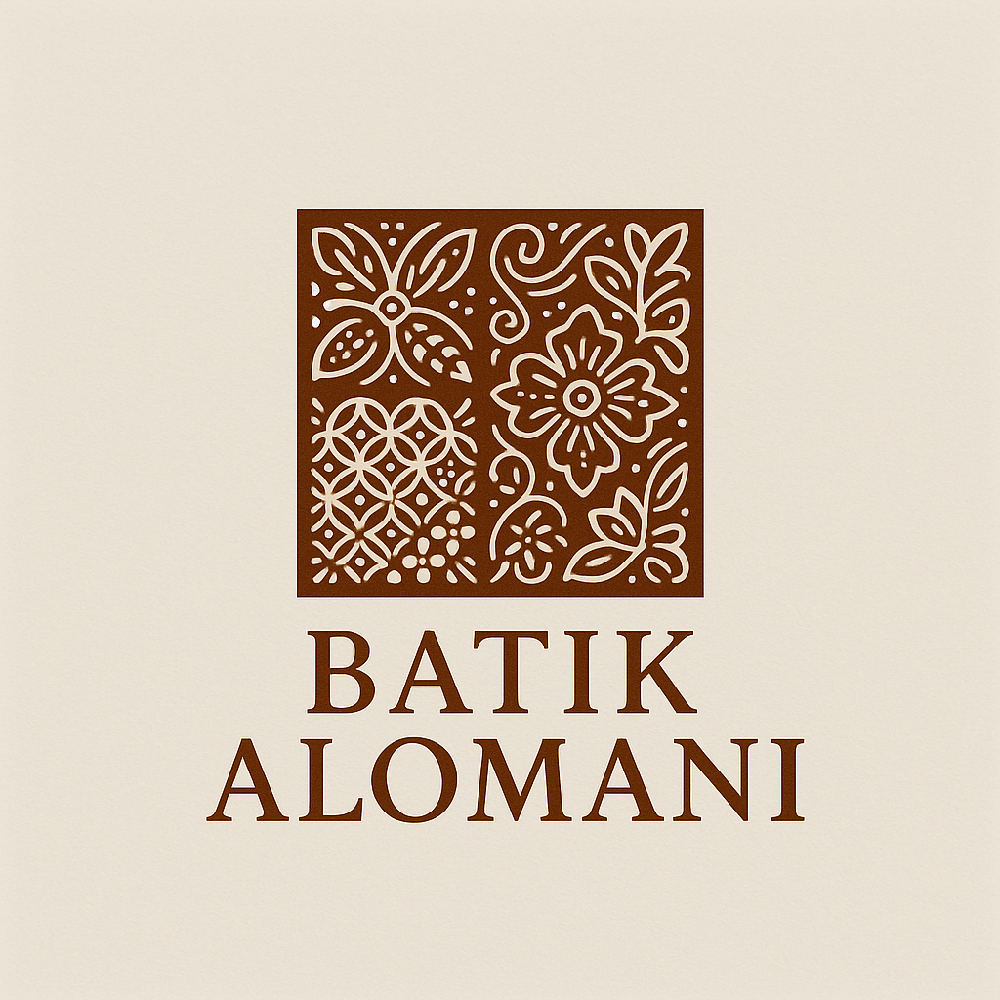

# 🦚 Batik Alomani - Aplikasi E-Commerce Batik Modern

<p align="center">
  
</p>

<p align="center">
  <a href="#fitur-utama"></a>
  <a href="#cara-menjalankan"></a>
  <a href="#teknologi"></a>
</p>

Sistem web modern untuk penjualan Batik Alomani, lengkap dengan dashboard admin, manajemen produk, pesanan, stok, laporan keuangan, live chat, dan tampilan responsif.

---

## ✨ Fitur Utama
- **Landing Page & Katalog Produk**: Kategori pria, wanita, dress, anak, accessories, dan produk baru.
- **Keranjang & Checkout**: Proses belanja mudah, checkout, dan riwayat pesanan.
- **Login User & Admin**: Satu form login, role user/admin, validasi email & password.
- **Dashboard Admin**: Kelola pesanan, produk, stok, laporan, dan pengaturan admin.
- **Live Chat**: Chat modern antara user & admin, tombol mengambang, bisa close.
- **Tampilan Modern**: Desain card, shadow, border-radius, warna konsisten, responsif.
- **Proteksi Akses**: Session & localStorage, hanya admin bisa akses dashboard admin.

---

## 🗂️ Struktur Folder
```
batik-alomani/
├── db_batik_alomani.sql         # Struktur database MySQL
├── src/
│   ├── index.php               # Landing page
│   ├── login.php               # Login user & admin
│   ├── register.php            # Registrasi user
│   ├── keranjang.php           # Keranjang belanja
│   ├── bayar.php               # Checkout & pembayaran
│   ├── detail.php              # Detail produk
│   ├── pria.php, wanita.php, dress.php, anak.php, accessories.php, new.php
│   ├── admin/
│   │   └── admin-dashboard.php # Dashboard admin
│   ├── component/
│   │   ├── header.php, footer.php
│   └── assets/
│       ├── images/             # Logo & gambar produk
│       ├── css/                # styles.css, login.css, nav-style.css
│       └── js/                 # scripts.js
└── package.json                # (Opsional, tidak digunakan)
```

---

## ⚙️ Cara Setup & Jalankan
1. **Clone repo & copy ke server lokal (Laragon/XAMPP/WAMP)**
2. **Import database**: 
   - Buka phpMyAdmin
   - Buat database `batik_alomani`
   - Import `batik.sql`
3. **Jalankan di browser**: 
   - Akses `http://localhost/batik-alomani/src/`
4. **Login Admin**:  
   - Email: `admin@admin.com`  
   - Password: `12345`

---

## 🛠️ Teknologi
- **Frontend**: HTML5, CSS3, Bootstrap 5, JavaScript (modular, modern)
- **Backend**: PHP (tanpa framework)
- **Database**: MySQL/MariaDB
- **Assets**: Logo, gambar produk, ikon FontAwesome & Bootstrap Icons

---

## 📖 Tujuan Dibuat
**Untuk Menuntaskan UAS dan Projek Matkul Pemograman Web**

---
> **Batik Alomani** — 
